# 🌹 Custom props

<table data-view="cards"><thead><tr><th></th><th></th><th data-hidden data-type="files"></th></tr></thead><tbody><tr><td></td><td>devhub_stove</td><td></td></tr><tr><td></td><td>devhub_plant_rose</td><td></td></tr><tr><td>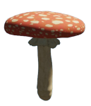</td><td>devhub_plant_mushroom</td><td></td></tr><tr><td>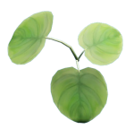</td><td>devhub_plant_medicinal_plantain</td><td></td></tr><tr><td></td><td>devhub_plant_jalapeno</td><td></td></tr><tr><td></td><td>devhub_plant_hadera_helix</td><td></td></tr><tr><td></td><td></td><td></td></tr><tr><td></td><td>devhub_plant_daisy</td><td></td></tr><tr><td>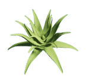</td><td>devhub_plant_aloe</td><td></td></tr><tr><td></td><td>devhub_pan</td><td></td></tr><tr><td>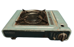</td><td>devhub_gasstove</td><td></td></tr><tr><td>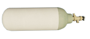</td><td>devhub_gas_tank</td><td></td></tr><tr><td>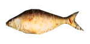</td><td>devhub_fish_fried</td><td></td></tr><tr><td>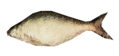</td><td>devhub_fish</td><td></td></tr><tr><td>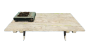</td><td>devhub_alchemy_table</td><td></td></tr><tr><td>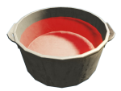</td><td>devhub_alchemy_pot_filled_red</td><td></td></tr><tr><td></td><td>devhub_alchemy_pot_filled_pink</td><td></td></tr><tr><td>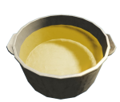</td><td>devhub_alchemy_pot_filled_orange</td><td></td></tr><tr><td>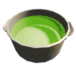</td><td>devhub_alchemy_pot_filled_green</td><td></td></tr><tr><td>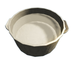</td><td>devhub_alchemy_pot_filled_normal</td><td></td></tr><tr><td>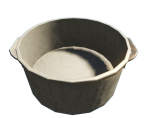</td><td>devhub_alchemy_pot_empty</td><td></td></tr><tr><td>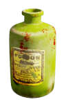</td><td>devhub_alchemy_bottle</td><td></td></tr></tbody></table>
