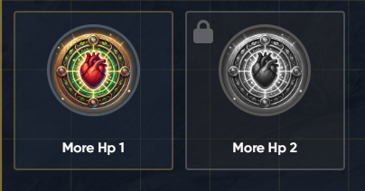

# 🆘 Compatibility test

To ensure the framework configuration is working correctly, run a compatibility test



### Go to <kbd>config.lua</kbd> and set **Shared.CompatibilityTest** to true



### Add new item named dh\_test



### Restart your server



### Join the server and type /dh\_startTest to start the test



### Follow the instructions shown in the game.



### Check the server console for the test results




During the test, you will need to use an item, revive yourself, and then you will be kicked from the server. Results will be shown in **server console** within 20 seconds after being kicked.


<figure><figcaption></figcaption></figure>
